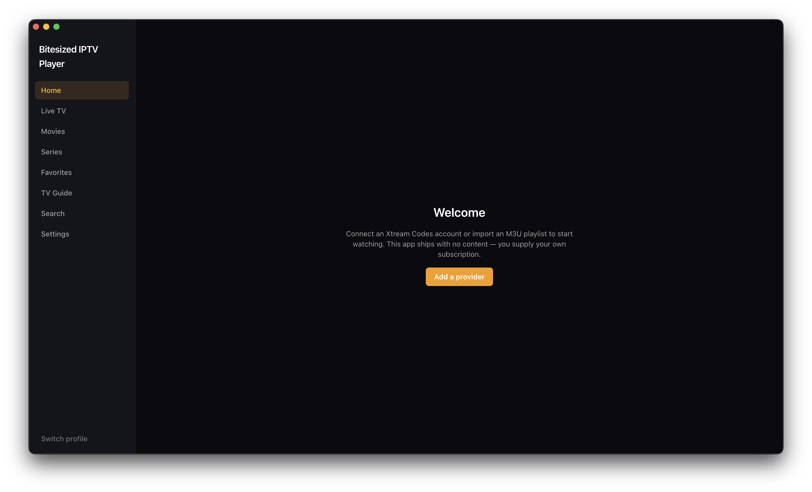

# Bitesized IPTV Player

A desktop IPTV player for **Xtream Codes** accounts and **M3U/M3U8** playlists.
Live TV, movies, series, a full TV guide, instant search across huge catalogs,
favourites, resume-where-you-left-off, and multiple profiles with kids and PIN
locks.

> **This app is a player only.** It ships with **no channels, no playlists and
> no credentials**. You connect your own IPTV subscription — an Xtream Codes
> login or an M3U playlist supplied by your provider. Everything streams
> directly from your provider; nothing is hosted, scraped or redistributed by
> this application. You are responsible for the legality of the services you
> connect to it.

Runs on macOS, Windows and Linux.



---

## Contents

- [What you get](#what-you-get)
- [Getting started](#getting-started)
- [Installing mpv](#installing-mpv)
- [Connecting a provider](#connecting-a-provider)
- [Using the app](#using-the-app)
- [Your data and privacy](#your-data-and-privacy)
- [Troubleshooting](#troubleshooting)
- [License](#license)

---

## What you get

**Live TV and the guide**

- A channel list with what's on now, progress bars, and a catch-up badge on
  channels your provider archives.
- A full TV-guide timeline (channels × time) with a now-line, jump-to-now and a
  programme detail panel.
- Guide data from XMLTV (including gzipped feeds) or your provider's built-in
  Xtream EPG, refreshed on a schedule.
- Channel zapping with ↑/↓ while you're watching.
- Catch-up: pick a past programme in the guide and play the recording.

**Movies and series**

- Poster grids with detail pages, seasons and episodes, and next-episode
  autoplay.
- Continue watching on the home screen; anything past 95% is marked finished.

**Finding things**

- Instant full-text search across the whole catalog — type `matr`, get
  _The Matrix_ — grouped by Live TV / Movies / Series, with a jump straight into
  the containing category.
- Categories with live counts, plus **All**, **Favourites**, **Recently added**
  and **Uncategorised**. You can hide categories you never use and drag the rest
  into the order you want.
- A favourites screen grouping everything you've starred by type and category.
- Built to stay smooth on catalogs of 100,000+ items.

**Playback**

- Full codec coverage through **mpv** — HEVC, AC3/EAC3, MPEG-TS — with hardware
  decoding. See [Installing mpv](#installing-mpv).
- Audio and subtitle track menus, subtitle timing and size adjustment, and
  external subtitles for Xtream movies.
- A control bar with a scrubbable seek bar, ±15s skip (channel skip on Live),
  volume with mute, and auto-hiding overlay controls.
- Fullscreen with the `f` key or the toolbar button.
- Resilience for flaky provider links: automatic reconnect, retry with backoff,
  and a watchdog that reloads a live stream that quietly stops progressing.

**Profiles and appearance**

- A "who's watching?" picker with multiple profiles and emoji avatars.
- Kids profiles hide adult categories everywhere — enforced in the database, not
  just hidden in the interface.
- Optional PIN locks on profile entry.
- Eight accent colours (Amber, Teal, Emerald, Sky, Ocean, Violet, Rose,
  Graphite) that re-tint the whole app instantly.

---

## Getting started

Prebuilt installers aren't published yet, so for now you run it from source. You
need [Node.js](https://nodejs.org) 20 or newer.

```bash
git clone https://github.com/bitesized/bitesized-iptv-player.git
cd bitesized-iptv-player
npm install
npm run dev
```

`npm install` takes a few minutes the first time — it downloads Electron and
compiles the database engine.

To build a packaged application instead:

```bash
npm run build
```

**You do not need mpv installed for this to work.** The app runs either way; mpv
just makes it play far more streams. See the next section.

---

## Installing mpv

The app has two playback engines:

|                     | **mpv engine**               | **built-in engine** |
| ------------------- | ---------------------------- | ------------------- |
| Requires            | mpv installed on your system | nothing             |
| H.264 + AAC streams | ✅                           | ✅                  |
| HEVC / H.265        | ✅                           | ❌                  |
| AC3 / EAC3 audio    | ✅                           | ❌                  |
| Subtitles           | ✅                           | ❌                  |
| Hardware decoding   | ✅                           | limited             |

A lot of real IPTV channels use HEVC or AC3, so **installing mpv is strongly
recommended**:

```bash
brew install mpv        # macOS
sudo apt install mpv    # Debian / Ubuntu
scoop install mpv       # Windows
```

Then **fully quit and reopen the app** — on macOS that means ⌘Q, not just
closing the window. The app checks for mpv once at startup.

On macOS, if you install mpv _after_ your first `npm install`, also run:

```bash
npm run build:native
```

This builds the small component that renders video inside the app window rather
than in a separate mpv window. It needs Xcode Command Line Tools
(`xcode-select --install`). Skipping it is fine — mpv still plays everything, it
just opens its own window.

**Settings → Playback tells you which engine is currently active**, so you can
always check whether mpv was picked up.

If you keep mpv somewhere unusual, set the `MPV_PATH` environment variable to
the binary. Otherwise the app looks in `/opt/homebrew/bin`, `/usr/local/bin`,
`/usr/bin` and `C:\Program Files\mpv`.

---

## Connecting a provider

On first launch you get a Default profile and a welcome screen. Choose **Add a
provider**, then either:

**Xtream Codes** — enter the server (`http://host:port`), your username and your
password. Credentials are checked before anything is saved.

**M3U playlist** — give it a playlist URL or pick a local `.m3u`/`.m3u8` file,
and optionally an XMLTV guide URL. If the playlist declares its own guide feed
via `url-tvg`, that's picked up automatically.

Either way the catalog imports in the background with a progress toast — you can
start browsing before it finishes. Re-syncing later only transfers what changed,
so refreshing a large catalog is quick.

If your provider limits how many streams you can watch at once, set that limit
on the provider in Settings and the app will respect it.

---

## Using the app

- **Favourite** anything with the star on a card or row.
- **Resume** is automatic — reopen a movie or episode and it picks up where you
  stopped.
- **Keyboard and remote friendly**: arrow keys, Page Up/Down, Home and End move
  through every list and grid, with a visible focus ring throughout.
- **Right-click** cards and rows for quick actions.
- **Settings** is where you manage providers, refresh the guide, switch accent
  colour and check which playback engine is in use.

---

## Your data and privacy

- Everything lives locally in a SQLite database in your user data folder. There
  is no account, no telemetry and no server belonging to this project.
- Provider passwords are encrypted at rest using your operating system's
  keychain. On platforms with a keychain, plaintext credentials are never
  written to disk.
- Streams are fetched through a small proxy running on `127.0.0.1` inside the
  app. The player never contacts your provider directly, and provider
  credentials are never exposed to the interface layer.
- Logs redact credentials and stream URLs.

---

## Troubleshooting

**"Web engine fallback in use" in Settings → Playback**
mpv wasn't found. Install it (see [Installing mpv](#installing-mpv)) and fully
quit and reopen the app.

**A channel fails with a codec or media error, but others play fine**
Almost always an HEVC or AC3 stream on the built-in engine. Install mpv.

**Video opens in a separate mpv window on macOS**
The in-window video component isn't built. Run `npm run build:native` — you'll
need `brew install mpv` and `xcode-select --install` first.

**`[build-native] skipping mpv-embed addon` during `npm install`**
Not an error. The install succeeded and the app will run; this only means
in-window video on macOS isn't available yet. Install the two prerequisites
above and run `npm run build:native`.

**`NODE_MODULE_VERSION` mismatch on `better_sqlite3.node`**
Run `npx electron-rebuild -f -w better-sqlite3`.

**"Electron failed to install correctly"**
Delete `node_modules/electron/dist` and your Electron cache
(`~/Library/Caches/electron` on macOS), then reinstall.

**A live channel buffers forever**
The app retries and reloads automatically. If it persists, the provider link is
likely down — try another channel to confirm.

---

## License

GNU General Public License v3.0 or later — see [LICENSE](LICENSE).

Copyright © 2026 Bitesized IPTV Player contributors.
